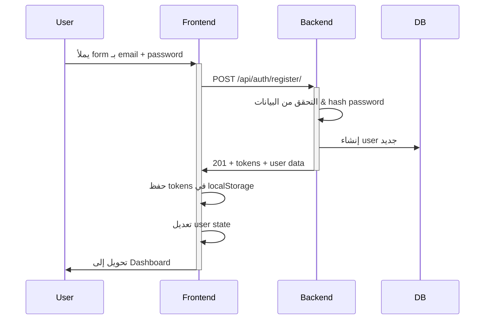

# 🔐 Authentication System Documentation

## نظرة عامة

نظام مصادقة احترافي يستخدم JWT (JSON Web Tokens) مع React hooks و Django REST Framework.

---

## 🏗️ المعمارية

```
┌─────────────────────────────────────────────┐
│            React Frontend                    │
│  ┌──────────────────────────────────────┐   │
│  │      AuthContext (State Mgmt)        │   │
│  │  - User state                        │   │
│  │  - Auth methods (login, register)    │   │
│  │  - Token management                  │   │
│  └──────────────────────────────────────┘   │
│            ↓ useAuth Hook ↓                 │
│  ┌──────────────────────────────────────┐   │
│  │    Components & Pages                │   │
│  │  - Auth.tsx (login/signup)           │   │
│  │  - ProtectedRoute                    │   │
│  │  - Dashboard                         │   │
│  └──────────────────────────────────────┘   │
└─────────────────────────────────────────────┘
         ↓ HTTP Requests (JWT) ↓
┌─────────────────────────────────────────────┐
│         Django REST Backend                  │
│  ┌──────────────────────────────────────┐   │
│  │      Authentication Endpoints        │   │
│  │  - /api/auth/register/              │   │
│  │  - /api/auth/login/                 │   │
│  │  - /api/auth/logout/                │   │
│  │  - /api/auth/me/                    │   │
│  │  - /api/auth/token/refresh/         │   │
│  └──────────────────────────────────────┘   │
│            ↓ Database ↓                     │
│  ┌──────────────────────────────────────┐   │
│  │      User Model (Django Auth)        │   │
│  │  - id, username, email               │   │
│  │  - password (hashed)                 │   │
│  │  - first_name, last_name             │   │
│  └──────────────────────────────────────┘   │
└─────────────────────────────────────────────┘
```

---

## 🚀 البدء

### 1️⃣ استيراد AuthProvider في App.tsx

```tsx
import { AuthProvider } from "./contexts/AuthContext";

export default function App() {
  return (
    <AuthProvider>
      <Routes>
        {/* ... */}
      </Routes>
    </AuthProvider>
  );
}
```

### 2️⃣ استخدام useAuth في أي component

```tsx
import { useAuth } from '@/hooks/useAuth';

function MyComponent() {
  const { user, login, logout, isAuthenticated } = useAuth();

  if (!isAuthenticated) {
    return <div>من فضلك سجل دخول أولاً</div>;
  }

  return (
    <div>
      <p>مرحباً {user?.first_name}</p>
      <button onClick={logout}>تسجيل الخروج</button>
    </div>
  );
}
```

### 3️⃣ حماية الـ Routes

```tsx
import { ProtectedRoute } from '@/components/ProtectedRoute';

<Route 
  path="/dashboard" 
  element={
    <ProtectedRoute>
      <Dashboard />
    </ProtectedRoute>
  } 
/>
```

---

## 🔑 Tokens Management

### Access Token

- **المدة:** 1 ساعة (قابلة للتخصيص)
- **الـ Payload:** User ID + permissions
- **الاستخدام:** في جميع الـ API requests

```typescript
headers: {
  Authorization: `Bearer ${accessToken}`
}
```

### Refresh Token

- **المدة:** 7 أيام
- **الـ Payload:** User ID
- **الاستخدام:** لتحديث الـ access token عند انتهاء صلاحيته

---

## 📡 API Endpoints

### تسجيل جديد (Sign Up)

```http
POST /api/auth/register/

{
  "email": "user@example.com",
  "password": "SecurePassword123",
  "first_name": "أحمد",
  "last_name": "محمد"
}

Response 201:
{
  "message": "تم إنشاء الحساب بنجاح",
  "user": {
    "id": 1,
    "email": "user@example.com",
    "first_name": "أحمد",
    "last_name": "محمد"
  },
  "tokens": {
    "access": "eyJ0eXAiOiJKV1QiLCJhbGc...",
    "refresh": "eyJ0eXAiOiJKV1QiLCJhbGc..."
  }
}
```

### تسجيل الدخول (Login)

```http
POST /api/auth/login/

{
  "email": "user@example.com",
  "password": "SecurePassword123"
}

Response 200:
{
  "message": "تم تسجيل الدخول بنجاح",
  "user": {...},
  "tokens": {...}
}
```

### الحصول على بيانات المستخدم الحالي

```http
GET /api/auth/me/

Headers:
Authorization: Bearer <access_token>

Response 200:
{
  "id": 1,
  "email": "user@example.com",
  "first_name": "أحمد",
  "last_name": "محمد",
  "username": "user@example.com"
}
```

### تحديث الـ Token

```http
POST /api/auth/token/refresh/

{
  "refresh": "<refresh_token>"
}

Response 200:
{
  "access": "<new_access_token>"
}
```

### تسجيل الخروج (Logout)

```http
POST /api/auth/logout/

Headers:
Authorization: Bearer <access_token>

{
  "refresh": "<refresh_token>"
}

Response 200:
{
  "message": "تم تسجيل الخروج بنجاح"
}
```

---

## 🔒 أفضل الممارسات

### 1️⃣ التخزين الآمن للـ Tokens

```typescript
// ✅ صحيح - localStorage (مقبول للـ development)
localStorage.setItem('tokens', JSON.stringify(tokens));

// ⚠️ تحذير - لا تستخدم sessionStorage للـ production
// ❌ خطأ - لا تضع الـ tokens في الـ URL أو global variables
```

### 2️⃣ إرسال الـ Token مع الـ Requests

```typescript
// ✅ صحيح
const response = await fetch('/api/predict/', {
  headers: {
    Authorization: `Bearer ${accessToken}`
  }
});

// ❌ خطأ
const response = await fetch('/api/predict/?token=xyz');
```

### 3️⃣ معالجة انتهاء صلاحية الـ Token

```typescript
// ✅ تلقائياً عند 401 Unauthorized
if (response.status === 401) {
  // Delete tokens والـ redirect للـ login
  navigate('/auth');
}

// ✅ في AuthContext
const refreshToken = async () => {
  const newTokens = await apiCall(REFRESH_ENDPOINT, {...});
  setStoredTokens(newTokens);
};
```

### 4️⃣ حماية المسارات الحساسة

```tsx
// ✅ صحيح - ProtectedRoute
<ProtectedRoute>
  <Dashboard />
</ProtectedRoute>

// أيضاً يمكنك التحقق من الـ permissions
<ProtectedRoute requiredRole="admin">
  <AdminPanel />
</ProtectedRoute>
```

---

## 🧪 الاختبار

### اختبار يدوي في المتصفح

```javascript
// في DevTools Console
// 1. التسجيل
await fetch('http://localhost:8000/api/auth/register/', {
  method: 'POST',
  headers: {'Content-Type': 'application/json'},
  body: JSON.stringify({
    email: 'test@example.com',
    password: 'TestPass123',
    first_name: 'أحمد',
    last_name: 'محمد'
  })
}).then(r => r.json()).then(console.log);

// 2. تسجيل الدخول
const login = await fetch('http://localhost:8000/api/auth/login/', {...});
const data = await login.json();
console.log(data.tokens.access);

// 3. استخدام الـ token
await fetch('http://localhost:8000/api/auth/me/', {
  headers: {Authorization: `Bearer ${data.tokens.access}`}
}).then(r => r.json()).then(console.log);
```

---

## 🐛 Debugging Tips

### في التطوير

```typescript
// في AuthContext.tsx
useEffect(() => {
  if (import.meta.env.DEV) {
    console.log('👤 Current User:', user);
    console.log('🔑 Tokens:', getStoredTokens());
  }
}, [user]);
```

### في Network Tab (DevTools)

1. اضغط F12 → Network tab
2. شوف جميع الـ auth requests
3. فتّش الـ headers → Authorization
4. فتّش الـ response → tokens

### Common Issues

| المشكلة | السبب | الحل |
|--------|--------|------|
| CORS Error | الـ backend ما يسمح للـ frontend | أضف الـ origin للـ CORS whitelist |
| 401 Unauthorized | الـ token انتهت صلاحيته | استخدم refresh token أو أعد تسجيل الدخول |
| Token not sent | نسيان الـ Authorization header | تأكد من الـ header في API calls |
| Password weak | كلمة المرور ضعيفة | يجب: 8+ أحرف، حروف كبيرة، أرقام |

---

## 🔄 تدفق التسجيل الكامل



---

## 🎯 الخطوات القادمة

- [ ] إضافة "Remember me" لأسبوعين
- [ ] Two-factor authentication (2FA)
- [ ] Social login (Google, GitHub)
- [ ] Reset password
- [ ] Email verification
- [ ] Admin dashboard لإدارة المستخدمين

---

## 📚 المراجع

- [AuthContext](../contexts/AuthContext.tsx)
- [useAuth Hook](../hooks/useAuth.ts)
- [ProtectedRoute](../components/ProtectedRoute.tsx)
- [Auth Page](./Auth.tsx)
- [Backend Auth Views](../../backend/backendfirst/api/auth.py)
- [JWT Documentation](https://django-rest-framework-simplejwt.readthedocs.io/)
